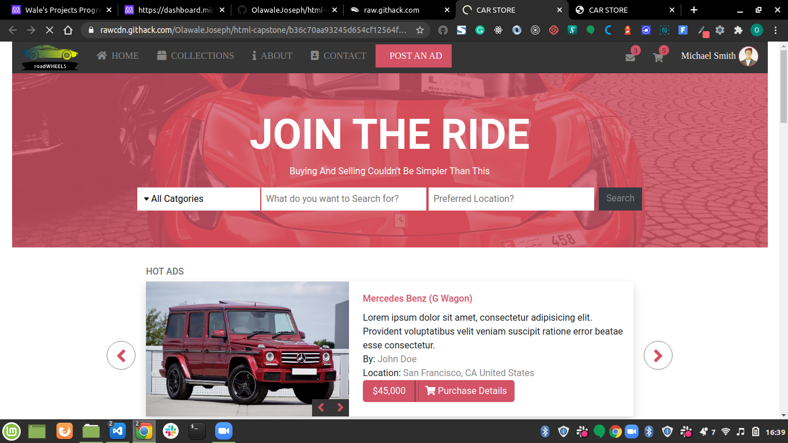

# HTML & CSS Capstone Project

> This a is an Online Car Store where users can buy and sell their cars, either old or new.
  This project is built as my Capstone Project for the HTML and CSS section at Microvese.
  Building this project has helped to solidify my understanding of the HTMl, CSS, BOOTSTRAP, Animations and Transitions. 

## Implementation
- Users can update their profile image and have it displayed at the top of the page.
- Users can see the list of cars grouped into different categories such as Luxury, Sedan, Sallon, Vintage... 
- Users can Search for a car by name, model or location
- On the results page, Users can filter their search by parameters should such as price, new, used...
- The Footer section has a navigation area for easy access.
- The company logo is animated to simulate a moving car.

## Built With

- HTML5, CSS3
- BOOTSTRAP,
- GIT, STYLELINT, WEBHINT, GITHUB ACTIONS
- This project was built using flexbox and grid for layout and alignment.

## Live Demo

[Live Demo Link](https://rawcdn.githack.com/OlawaleJoseph/html-capstone/b36c70aa93245d654cf12564f2454912e59b20a1/index.html)

## Getting Started

To get a local copy up and running follow these simple example steps.

### Prerequisites
- GIT
- BROWSER

### Setup
- Clone this repo
- cd into the cloned repo
- Open the index.html file with any browser of your choice

### Deployment
- This simple webpage can be deployed on any web hosting platform

## Author

👤 **Olawale**

- Github: [@githubhandle](https://github.com/OlawaleJoseph)
- Twitter: [@twitterhandle](https://twitter.com/javanode123)
- Linkedin: [linkedin](www.linkedin.com/in/olawale-adedeko)

## 🤝 Contributing

Contributions, issues and feature requests are welcome!

Feel free to check the [issues page](https://github.com/OlawaleJoseph/html-capstone/issues).

## Show your support

Give a ⭐️ if you like this project!

## Acknowledgments

- Mohammed Awad (UI DESIGN)
- BOOTSTRAP TEAM
- MICROVERSE

## 📝 License

This project is [MIT](lic.url) licensed.
